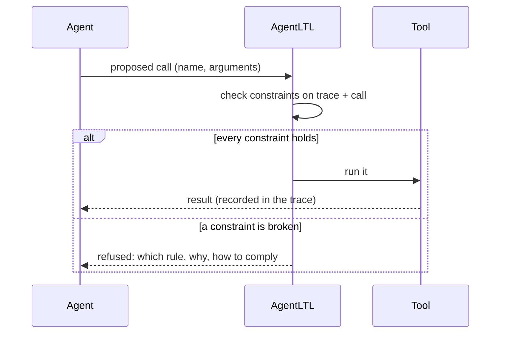

# Enforcing rules at run time

## Checked before the call runs

At run time, AgentLTL sits between the agent and its tools. For each tool call the agent
proposes, it evaluates every constraint on the trace so far *plus the proposed call*:

The refusal is written for the agent: the rule's reason, what about this call broke it,
and the way to comply. Most of the time the agent simply does the right thing next, as in
the [staging-to-prod example](../index.md).

Only calls that ran count as done. A refused call is never added to the trace, so it can't
satisfy a later "before".

## Modes: what happens on a violation

Each constraint has a severity. The coding-agent harnesses give them plain names:

| Mode | Severity | On violation |
|---|---|---|
| `block` | `PERSISTENT_BLOCK` | Refused every time; the agent can't override it |
| `warn` | `BLOCK_AND_WARN` | Refused once; the agent may repeat the exact call to override |
| `ask` | `PERSISTENT_BLOCK`, routed to the user | The human is asked to approve; the agent can't override |
| `retry` | `SOFT_BLOCK` | Refused a few times, then the human is asked |
| `stop` | `HARD_STOP` | Refused, and the agent may not act until the human replies; it can still explain |
| `log` | `TOLERATE` | Allowed; the agent is told it broke the rule |

When one call breaks several rules, the strongest mode decides, so a `warn` override can't
slip a call past a `block` rule.

The Python library exposes the severities directly, with escalation policies for
`SOFT_BLOCK` (cumulative, consecutive, hybrid): see
[constraint severities](../python/index.md#constraint-severities).

## Which formulas can be enforced

Refusing a call needs a violation that is visible *now*. Some formulas can never be
refuted part-way through a run:

- **Safety** properties ("never X", "at most N", "B only after A") fail at a definite call,
  and are what enforcement is for.
- **Liveness** properties ("eventually X") can always still be satisfied later. Refusing a
  call because `done` hasn't been called *yet* would stop every run.

AgentLTL classifies every constraint as `SAFE`, `UNSAFE` or `AMBIGUOUS` before a run, and
warns (or, in the harnesses, refuses the rule) when a liveness property is given a blocking
severity. Bounded versions are fine: "within 3 steps after X, Y" is safe. Details:
[runtime-safety classification](../python/index.md#runtime-safety-classification).

The check runs on a *partial* trace, so operators look ahead carefully: at the last call,
"next X" is *undecided*, not false. The call being checked isn't refused just because
nothing has followed it yet.

## Memory: which calls count

A harness decides which trace a rule reads. In the Claude Code plugin:

- **session** (default): the calls of this session. It survives compaction and resume, and
  starts empty in a new session.
- **project**: every call made in the project, across sessions. Use it for rules such as
  "prod only gets what staging ran", where staging may have been yesterday.
