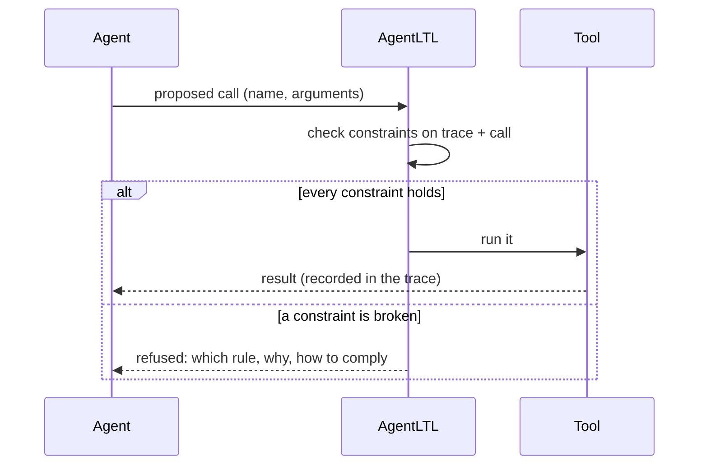

# Enforcing rules at run time

## Checked before the call runs

At run time, AgentLTL sits between the agent and its tools. For each tool call the agent
proposes, it evaluates every constraint on the trace so far *plus the proposed call*:



The refusal is written for the agent: the rule's reason, what about this call broke it,
and the way to comply. Most of the time the agent simply does the right thing next, as in
the [staging-to-prod example](../index.md).

Only calls that ran count as done. A refused call is never added to the trace, so it can't
satisfy a later "before".

## Modes: what happens on a violation

Each rule has a *mode*, which says what happens when a call breaks it. The mode is the name
you write in `AGENTLTL.yaml`. The *severity* column is the name the Python library uses for
the same thing; if you only write rule files, ignore it.

| Mode | Severity | On violation |
|---|---|---|
| `block` | `PERSISTENT_BLOCK` | Refused every time; the agent can't override it |
| `warn` | `BLOCK_AND_WARN` | Refused once; the agent may repeat the exact call to override |
| `ask` | `PERSISTENT_BLOCK`, routed to the user | The human is asked to approve; the agent can't override |
| `retry` | `SOFT_BLOCK` | Refused a few times, then the human is asked |
| `stop` | `HARD_STOP` | Refused, and the agent may not act until the human replies; it can still explain |
| `log` | `TOLERATE` | Allowed; the agent is told it broke the rule |

When one call breaks several rules, the strongest mode decides, so a `warn` override can't
slip a call past a `block` rule.

The Python library exposes the severities directly, with escalation policies for
`SOFT_BLOCK` (cumulative, consecutive, hybrid): see
[constraint severities](../python/index.md#constraint-severities).

## Judging a run that isn't over

A call is checked on a *partial* trace: the run may still do anything afterwards. So at
run time a formula takes one of five values, not two:

| Value | Meaning | Example |
|---|---|---|
| violated | broken, and nothing later can repair it | `never deploy`, after a deploy |
| not met yet | an obligation still open: a later call can meet it | `called("pytest")` before pytest runs |
| pending | not triggered, or not decided yet | `before("test", "push")` before any push; "eventually X" |
| holds so far | satisfied, but a later call could break it | `at most 2 deploys` after one |
| holds | satisfied, and nothing later can change that | `called("pytest")` after pytest ran |

A call is refused when the value drops below *pending*. Negation mirrors the scale, so
`!before("a", "b")` is pending (not violated) while no b has run, and "next X" at the last
call is pending, not false.

On a finished trace (scoring a run afterwards) the ordinary two-valued semantics apply.

## Refusing only what a call breaks

Once a rule is broken for good, it stays broken: say a `warn` rule was overridden on
purpose. Refusing every later call for it would lock the agent out of its tools and repair
nothing. So AgentLTL tracks *which instance* of a rule failed (a position of `G`, a side of
`&`, an entity of a quantifier, a count) and refuses a call only when it creates a new
failure:

```
rule: G(now("deploy") -> X(G(!now("deploy"))))     # deploy at most once, warn mode
deploy   allowed
deploy   refused (warning)
deploy   allowed: the agent insisted
ls       allowed: the broken instance is the earlier deploy's, not this call's
deploy   refused: a new violation
```

An obligation that isn't met yet is never final, so a call can always still be refused
for it, and steered towards meeting it.

## Which formulas can be enforced

AgentLTL classifies every constraint before a run, from the values it can take:

- **SAFE**: it only fails for good ("never X", "at most N", "B only after A",
  `before(a, b)`): every refusal points at a real violation made by that call.
- **UNSAFE**: it can fail while an obligation is open (a bare `called("x")`), so a blocking
  severity refuses every call until the obligation is met.
- **INERT**: it can't fail before the run ends ("eventually X", `in_order`), so a blocking
  severity would never fire. Check it when the agent finishes, or bound it: "within 3
  steps after X, Y" is SAFE.
- **AMBIGUOUS**: a predicate that declared nothing, or an unknown node.

The Python library warns when an UNSAFE or INERT constraint gets a blocking severity; the
harnesses reject such rules. Details:
[runtime-safety classification](../python/index.md#runtime-safety-classification).

## Memory: which calls count

A harness decides which trace a rule reads. In the Claude Code, Copilot CLI, Mistral
Vibe and Codex plugins:

- **session** (default): the calls of this session. It survives compaction and resume, and
  starts empty in a new session.
- **project**: every call made in the project, across sessions. Use it for rules such as
  "prod only gets what staging ran", where staging may have been yesterday.
